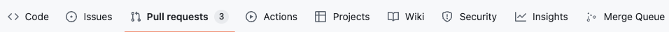

# Github Merge Queue

Adds a tab to quickly link to the merge queue if repo is using one.

## Development

- Clone this repo
- In Chrome, go to manage extensions
- Turn developer mode on
- Click load unpacked
- Select this folder
